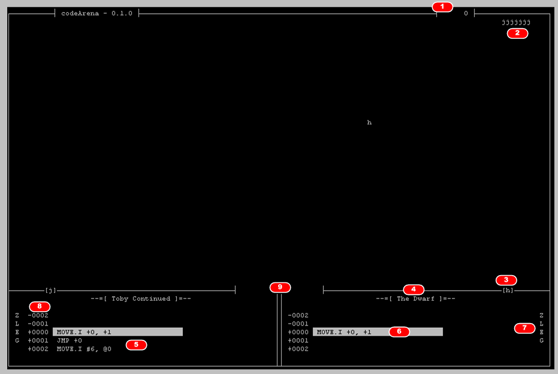

# CodeArena

A personal implementation of the Corewar challenge.  
This was done in 2011 and saved here for educational purpose (if there is any).

## Principle

Two programs (aka gladiators) compete against each others to win.  
The Arena represents the memory of the "virtual" computer in which the programs compete.

### Winning or Losing

A gladiator loses because of:

- a division by zero
- access an invalid memory cell
- execute an unknown opcode
- execute the KILL command (suicide)
- execute an invalid operation

Both gladiators lose if they don't manage to kill their opponent when the game end.  
A game end when all the CPU cycle have been consumed.

## Arena

The Arena looks like this:

1 Number of core cycle since the beginning  
2 The memory cells occupied by one of the gladiator  
3 The marker for this gladiator  
4 The name of the gladiator  
5 The current frame of instructions for this gladiator  
6 The current instruction executed  
7 The status of the flags  
8 The Program Counter  
9 The total occupation zone for each gladiator  

## Instructions

The available instructions are:

- MOVE : Move 
- JMP : Inconditional jump
- JZ : Jump if flag Z is set
- JNZ : Jump if flag Z is not set
- JG : Jump if flag G is set
- JNG : Jump if flag G is not set
- JL : Jump if flag L is set
- JNL : Jump if flag L is not set
- JE : Jump if flag E is set
- JNE : Jump if flag E is not set
- CMP : compare 
- ADD/SUB/MUL/DIV : arithmetic operators
- AND/OR/XOR/NOT : boolean operators
- NOP : no operation
- KILL : suicide

Each instruction can have one of the modifier below:

- 0..5
- A, B
- AB, BA
- X
- F
- I

The supported addressing mode are:

- \# : a value
- \+ : direct with increment
- \- : direct with decrement
- \@ : indirect

